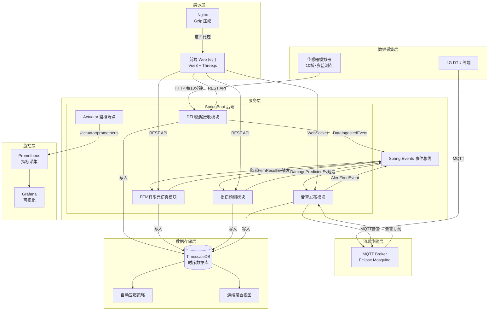
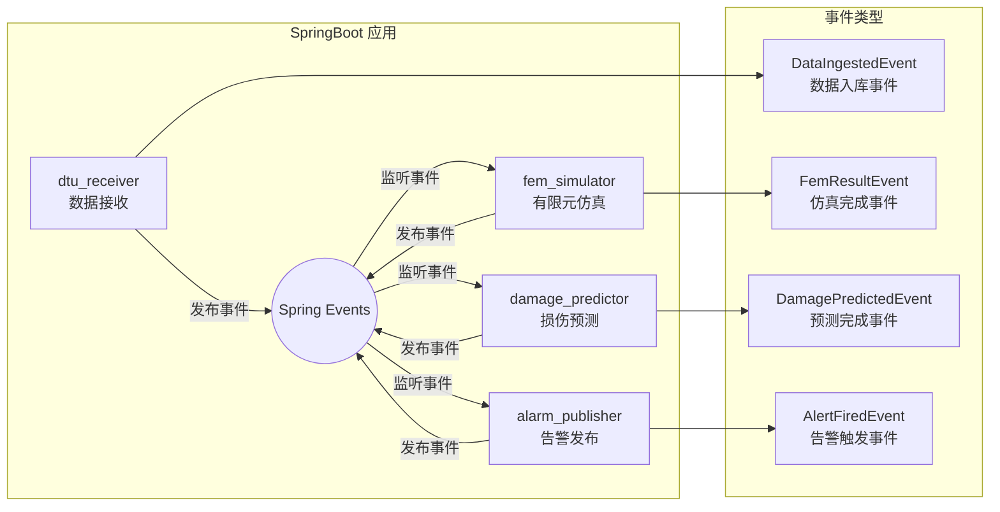
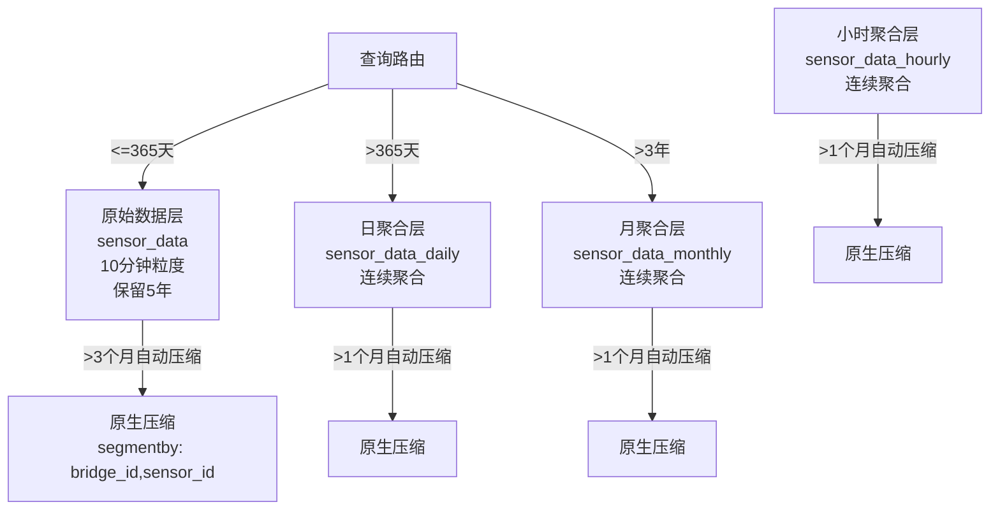

# 古代石拱桥结构健康监测与力学仿真系统

## 目录
- [系统架构](#系统架构)
- [技术栈](#技术栈)
- [快速部署](#快速部署)
- [传感器模拟器使用指南](#传感器模拟器使用指南)
- [监控与运维](#监控与运维)
- [数据注入功能](#数据注入功能)
- [API 接口](#api-接口)

---

## 系统架构

### 整体架构图



### 模块架构图



### 时序数据分层架构



---

## 技术栈

### 后端
- **框架**: Spring Boot 3.2.x + Java 21
- **ORM**: Spring Data JPA + Hibernate
- **数据库**: PostgreSQL 15 + TimescaleDB 2.13
- **消息队列**: Eclipse Mosquitto MQTT Broker
- **监控**: Spring Boot Actuator + Micrometer + Prometheus
- **事件驱动**: Spring Application Events
- **构建**: Maven 3.9

### 前端
- **框架**: Vue 3 + TypeScript + Vite
- **3D渲染**: Three.js + WebGL
- **图表**: ECharts 5
- **Web服务器**: Nginx (Gzip压缩)

### 仿真算法
- **FEM**: 2D梁单元有限元法 + 蒙特卡洛SFEM
- **损伤预测**: Paris公式 + Bayesian MCMC参数校准
- **应力分析**: 欧拉-伯努利梁理论 + LU分解

### DevOps
- **容器化**: Docker 多阶段构建
- **编排**: Docker Compose
- **时序优化**: TimescaleDB 原生压缩 + 连续聚合

---

## 快速部署

### 环境要求
- Docker >= 24.0
- Docker Compose >= 2.20
- 内存 >= 4GB (推荐 8GB)
- 磁盘 >= 20GB

### 一键启动

```bash
# 克隆项目
git clone <repository-url>
cd AI_solo_coder_task_A_111

# 启动核心服务 (数据库 + MQTT + 监控 + 后端 + 前端)
docker-compose up -d

# 启动核心服务 + 传感器模拟器
docker-compose up -d --profile simulator

# 启动全部服务 + 交互式模拟器
docker-compose up -d --profile simulator --profile interactive
```

### 服务清单

| 服务 | 容器名 | 端口 | 说明 |
|------|--------|------|------|
| TimescaleDB | bridge-timescaledb | 5432 | 时序数据库，自动初始化Schema |
| MQTT Broker | bridge-mqtt-broker | 1883/9001 | Eclipse Mosquitto，支持持久会话 |
| Prometheus | bridge-prometheus | 9090 | 指标采集与存储 |
| 后端服务 | bridge-backend | 8080 | SpringBoot 应用 |
| 前端服务 | bridge-frontend | 80 | Vue3 应用 + Nginx |
| 传感器模拟器 | bridge-simulator | - | 后台运行，非交互模式 |
| 交互式模拟器 | bridge-simulator-interactive | - | 需attach，支持命令注入 |

### 健康检查

```bash
# 查看所有服务状态
docker-compose ps

# 查看后端健康状态
curl http://localhost:8080/api/actuator/health

# 查看 Prometheus 目标状态
curl http://localhost:9090/api/v1/targets

# 查看数据库压缩策略
docker exec -it bridge-timescaledb psql -U postgres -d bridge_monitor -c \
  "SELECT view_name, schedule_interval, compress_after FROM timescaledb_information.jobs WHERE proc_name = 'policy_compression';"
```

### 访问地址

- **前端应用**: http://localhost
- **后端API**: http://localhost:8080/api
- **监控端点**: http://localhost:8080/api/actuator
- **Prometheus**: http://localhost:9090
- **MQTT WebSocket**: ws://localhost:9001

### 停止服务

```bash
# 停止所有服务
docker-compose down

# 停止并删除数据卷 (谨慎使用)
docker-compose down -v

# 只停止模拟器
docker-compose stop simulator
```

---

## 传感器模拟器使用指南

### 功能特性
- 支持 **10座** 著名古桥 (赵州桥、卢沟桥、广济桥等)
- 每座桥 **~30个** 监测点 (应变计、位移计、裂缝计、温度、振动)
- **10分钟** 上报间隔，支持加速模拟
- 支持 **应变异常注入** 和 **裂缝扩展注入**
- 支持 **交互式控制台** 动态注入数据

### 运行模式

#### 1. Docker 后台模式 (推荐)

```bash
# 启动后台模拟器
docker-compose up -d --profile simulator

# 查看模拟器日志
docker logs -f bridge-simulator

# 启动时注入应变异常
docker run --rm --network ai_solo_coder_task_a_111_default \
  bridge-simulator \
  --mode realtime --speedup 10 \
  --inject-strain 1 --strain-magnitude 80 --strain-duration 12
```

#### 2. Docker 交互模式

```bash
# 启动交互式模拟器
docker-compose up --profile interactive

# 或 attach 到已启动的容器
docker attach bridge-simulator-interactive
```

#### 3. 本地直接运行

```bash
cd simulator
pip install -r requirements.txt

# 实时模拟，1倍速
python sensor_simulator.py --mode realtime --speedup 1

# 实时模拟，10倍速 + 交互控制台
python sensor_simulator.py --mode realtime --speedup 10 --interactive

# 历史数据回灌 365 天
python sensor_simulator.py --mode historical --days 365

# 启动时注入异常
python sensor_simulator.py --inject-strain 1 --strain-magnitude 80
python sensor_simulator.py --inject-crack 2 --crack-rate 0.02
# 同时注入应变和裂缝
python sensor_simulator.py --inject-strain 1 --strain-magnitude 100 --inject-crack 1 --crack-rate 0.03
```

### 命令行参数

| 参数 | 类型 | 默认值 | 说明 |
|------|------|--------|------|
| `--mode` | string | realtime | 运行模式: realtime/historical |
| `--speedup` | int | 1 | 实时模式加速倍数 |
| `--days` | int | 365 | 历史模式回灌天数 |
| `--api` | string | http://backend:8080/api/data | API地址 |
| `--interactive` | flag | - | 启用交互式控制台 |
| `--inject-strain` | int | - | 启动时注入应变到指定桥ID |
| `--inject-crack` | int | - | 启动时注入裂缝到指定桥ID |
| `--strain-magnitude` | float | 60.0 | 应变异常幅度 (με) |
| `--strain-duration` | int | 6 | 应变异常持续步数 |
| `--crack-rate` | float | 0.01 | 裂缝扩展速率 (mm/步) |

### 交互式控制台命令

进入交互模式后 (`--interactive`)，可使用以下命令：

```
# 查看帮助
help

# 列出所有桥梁
list bridges

# 列出某桥所有传感器
list sensors 1

# 查看当前状态
status

# 注入应变异常到桥1的所有应变传感器
strain 1

# 注入应变异常到桥1的特定传感器，幅度80με，持续12步
strain 1 ST-001-001 80 12

# 注入裂缝扩展到桥2的所有裂缝传感器，速率0.02mm/步
crack 2

# 注入裂缝扩展到桥2的特定传感器
crack 2 CK-002-001 0.02

# 退出
quit
```

### 10座古桥配置

| ID | 桥名 | 跨数 | 基础应变(με) | 基础沉降(mm) | 基础裂缝(mm) |
|----|------|------|-------------|-------------|-------------|
| 1 | 赵州桥 | 1 | 80 | 2.5 | 1.2 |
| 2 | 卢沟桥 | 11 | 95 | 4.2 | 2.1 |
| 3 | 广济桥 | 19 | 70 | 3.0 | 1.5 |
| 4 | 洛阳桥 | 46 | 60 | 3.5 | 1.0 |
| 5 | 宝带桥 | 53 | 85 | 5.8 | 3.2 |
| 6 | 灞桥 | 16 | 110 | 9.5 | 4.8 |
| 7 | 安平桥 | 362 | 55 | 4.0 | 1.8 |
| 8 | 五亭桥 | 3 | 75 | 2.0 | 0.8 |
| 9 | 十字桥 | 5 | 100 | 6.5 | 2.5 |
| 10 | 风雨桥 | 5 | 65 | 3.8 | 1.1 |

### 传感器编码规则

```
ST-001-001
│   │   └── 传感器序号 (001-999)
│   └────── 桥梁ID (001-010)
└────────── 类型缩写
            ST=应变计, DP=位移计, CK=裂缝计
            TP=温度, VB=振动
```

---

## 监控与运维

### Actuator 端点

| 端点 | 说明 |
|------|------|
| `/api/actuator/health` | 健康检查，详细信息 |
| `/api/actuator/info` | 应用信息 |
| `/api/actuator/metrics` | 指标列表 |
| `/api/actuator/metrics/{name}` | 具体指标详情 |
| `/api/actuator/prometheus` | Prometheus 格式指标 |

### 关键指标

```
# JVM 指标
jvm_memory_used_bytes
jvm_gc_pause_seconds_sum

# 数据源指标
hikaricp_connections_active
hikaricp_connections_pending

# HTTP 请求指标
http_server_requests_seconds_count
http_server_requests_seconds_sum

# 自定义标签
application="bridge-monitor"
```

### TimescaleDB 自动压缩策略

**原始数据表 `sensor_data`**:
- 压缩时机: 超过 3 个月
- 分段键: `bridge_id, sensor_id`
- 排序键: `timestamp DESC`
- 压缩率: ~80-90%

**连续聚合视图**:
- `sensor_data_hourly`: 超过 1 个月自动压缩
- `sensor_data_daily`: 超过 1 个月自动压缩
- `sensor_data_monthly`: 超过 1 个月自动压缩

**查看压缩状态**:
```sql
-- 查看压缩策略
SELECT view_name, schedule_interval, compress_after
FROM timescaledb_information.jobs
WHERE proc_name = 'policy_compression';

-- 查看压缩率
SELECT hypertable_name,
       pg_size_pretty(before_compression_total_bytes) AS before,
       pg_size_pretty(after_compression_total_bytes) AS after,
       ROUND(100.0 * after_compression_total_bytes / before_compression_total_bytes, 2) AS ratio_pct
FROM timescaledb_information.compressed_hypertable_stats;
```

### Nginx Gzip 配置

前端 Nginx 已启用 Gzip 压缩：
- 压缩级别: 6
- 压缩类型: `text/html`, `text/css`, `application/javascript`, `application/json`, `image/svg+xml`
- 最小压缩长度: 1024 bytes
- 静态资源缓存: 30天

---

## 数据注入功能详解

### 应变异常注入

**注入模型**:
```
value = base_value + season + daily + drift + injection
```

**注入波形** (正弦渐变):
```
injection = magnitude * sin(π * step / duration)
```

**使用场景**:
- 模拟重车过桥引起的应变突增
- 模拟结构损伤引起的应变异常
- 测试告警阈值触发逻辑

### 裂缝扩展注入

**注入模型**:
```
value = base_value + season + daily + drift + (rate * step_offset)
```

**使用场景**:
- 模拟裂缝线性扩展
- 验证 Paris 公式预测精度
- 测试养护建议生成逻辑

---

## API 接口

### 数据接收
- `POST /api/data/batch` - 批量上传传感器数据
- `GET /api/data/trend?sensorId={id}&days={n}` - 查询趋势数据

### 桥梁管理
- `GET /api/bridges` - 获取桥梁列表
- `GET /api/bridges/{id}` - 获取桥梁详情
- `GET /api/bridges/{id}/sensors` - 获取桥梁传感器

### 仿真分析
- `POST /api/fem/simulate/{bridgeId}` - 触发FEM仿真
- `GET /api/fem/results/{bridgeId}` - 获取仿真结果

### 损伤预测
- `POST /api/damage/predict/{bridgeId}` - 触发损伤预测
- `GET /api/damage/results/{bridgeId}` - 获取预测结果

### 告警管理
- `GET /api/alerts?bridgeId={id}&level={level}` - 查询告警
- `PUT /api/alerts/{id}/ack` - 确认告警

---

## 目录结构

```
AI_solo_coder_task_A_111/
├── backend/                          # SpringBoot 后端
│   ├── src/main/java/com/heritage/bridge/
│   │   ├── dtu/                      # 数据接收模块
│   │   ├── fem/                      # FEM仿真模块
│   │   ├── damage/                   # 损伤预测模块
│   │   ├── alarm/                    # 告警发布模块
│   │   ├── event/                    # 事件定义
│   │   ├── config/                   # 配置类
│   │   └── simulation/               # 仿真核心算法
│   ├── src/main/resources/
│   │   ├── application.yml           # 应用配置
│   │   └── sql/01_init_schema.sql    # 数据库初始化
│   ├── Dockerfile                    # 多阶段构建
│   └── pom.xml
├── frontend/                         # Vue3 前端
│   ├── src/
│   │   ├── components/
│   │   ├── utils/
│   │   │   ├── bridge_3d_viewer.js   # 3D查看器
│   │   │   └── damage_panel.js       # 损伤面板
│   │   └── views/
│   ├── Dockerfile
│   └── nginx.conf                    # Gzip配置
├── simulator/                        # 传感器模拟器
│   ├── sensor_simulator.py           # 主程序
│   ├── Dockerfile
│   └── requirements.txt
├── mosquitto/                        # MQTT配置
│   └── mosquitto.conf
├── prometheus/                       # 监控配置
│   └── prometheus.yml
├── docker-compose.yml                # 服务编排
└── README.md
```

---

## 常见问题

**Q: 数据库初始化失败怎么办？**
```bash
# 删除数据卷重新初始化
docker-compose down -v
docker-compose up -d timescaledb
# 等待初始化完成 (约30秒)
docker logs bridge-timescaledb | grep "ready to accept"
```

**Q: 模拟器上报失败怎么办？**
```bash
# 检查后端是否健康
curl http://localhost:8080/api/actuator/health

# 检查网络连通性
docker exec bridge-simulator ping backend
```

**Q: 如何查看压缩效果？**
```bash
docker exec -it bridge-timescaledb psql -U postgres -d bridge_monitor \
  -c "SELECT hypertable_name, pg_size_pretty(before_compression_total_bytes) as before,
      pg_size_pretty(after_compression_total_bytes) as after
      FROM timescaledb_information.compressed_hypertable_stats;"
```

**Q: 前端加载慢怎么办？**
- 确认 Nginx Gzip 已启用: `curl -I -H "Accept-Encoding: gzip" http://localhost/assets/index.js`
- 检查响应头是否包含 `Content-Encoding: gzip`

---

## License

MIT License
